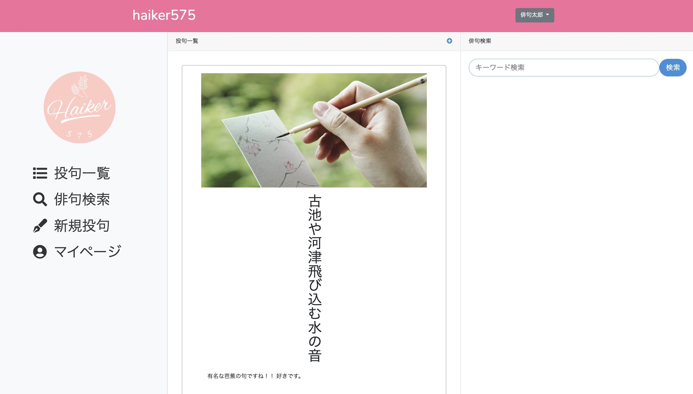
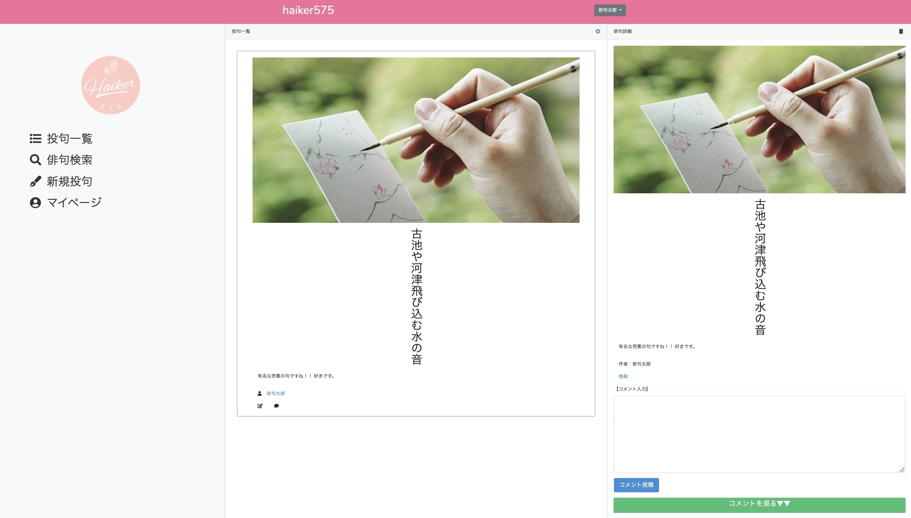
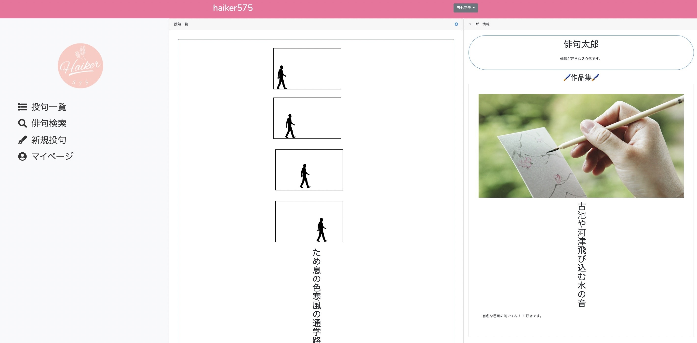

# アプリケーション名
【haiker575】
- 俳句を投稿したり、他人の投稿を閲覧したりすることができるアプリケーション

# アプリケーション概要
- アカウントを作成する
- 俳句を投稿する
- 他人の投稿にコメントをする
- 俳句を編集する
- 俳句を削除する

# URL
[haiker575 -Heroku](https://haiker575.herokuapp.com/)

# 利用方法

## トップページ

- トップページ上部右のボタンから「新規登録」、「ログイン」できる

## 新規投稿

- トップページのサイドバー「新規投稿」ボタン、もしくは「俳句一覧」の右のボタンから新規投稿できる

## 俳句詳細表示

- 投稿された俳句のコメントマークから俳句の詳細ページへ遷移できる

## コメント投稿

- 投稿された俳句のコメントマークから俳句の詳細ページへ遷移し、コメントを投稿できる
- 投稿されたコメントを一覧で閲覧することもできる

## 俳句編集

- 自身が投稿した俳句の左下の編集マークから俳句の編集ができる

## 俳句削除
- 「俳句編集画面」と「俳句詳細画面」の右上のマークから自身が投稿した俳句を削除することができる

## マイページ表示

- トップページのサイドバー「マイページ」ボタンからマイページへ遷移できる
- ユーザー情報と投稿した俳句を一覧で閲覧できる

## ユーザーページ表示

- 投稿された俳句のユーザー名からユーザーページへ遷移できる
- ユーザー情報と投稿した俳句を一覧で閲覧できる

## 俳句検索

- トップページのサイドバー「俳句検索」ボタンから俳句検索ができる

# 制作背景(意図)
- 俳句が趣味な人が簡単に俳句を公開でき、更に幅広いユーザーに見てもらって、評価を貰えるようなサービスを実現したいという想いから開発を開始。

# 実装した機能
- ユーザー管理機能(新規登録・ログイン)
- 俳句投稿機能
- 俳句一覧表示機能
- 俳句詳細表示機能
- 俳句編集機能
- 俳句削除機能
- コメント投稿機能
- マイページ表示機能
- 俳句検索機能
- レスポンシブデザイン化

# 工夫したポイント
- レイアウトファイルを活用し、各機能ごとの画面の移り変わりを最小限にすることで、利便性の向上に努めたこと。
- 俳句を縦書き表示にし、見やすくしたこと。
- レスポンシブデザイン化したこと。

# 課題や今後実装した機能
- エラー文章の日本語化
- Basic認証のようなセキュリティ機能の実装
- ダイレクトメッセージ機能の実装

# データベース設計

## usersテーブル
| Column               | Type       | Options                        |
| ------               | ---------- | ------------------------------ |
| name                 | string     | null: false                    |
| email                | string     | null: false, unique: true      |
| encrypted_password   | string     | null: false                    |
| profile              | text       | null: false                    |

### Association
- has_many :posts
- has_many :comments

## postsテーブル
| Column               | Type       | Options                        |
| ------               | ---------- | ------------------------------ |
| ku                   | string     | null: false                    |
| description          | text       | null: false                    |
| image                | text       | null: false                    |
| user_id              | references | null: false, foreign_key: true |

### Association
- belongs_to :user
- has_many :comments

## commentsテーブル
| Column               | Type       | Options                        |
| ------               | ---------- | ------------------------------ |
| text                 | text       | null: false                    |
| user_id              | references | null: false, foreign_key: true |
| post_id              | references | null: false, foreign_key: true |

### Association
- belongs_to :user
- belongs_to :post

# 備考・参考にしたサイト
フロントサイド
- Bootstrap5公式ページ
  (https://getbootstrap.jp/)
- Bootstrapの導入レッスン
  (https://skillhub.jp/courses/168)
- Adobe Creative Cloud Express公式ページ
  (https://www.adobe.com/jp/express/create/logo)
- Fontawsome公式ページ
  (https://fontawesome.com/)

サーバーサイド
- laravel6公式ページ
  (https://readouble.com/laravel/6.x/ja/)
- MAMPのインストール方法
  (https://codeforfun.jp/how-to-install-mamp-windows-and-mac/#i-3)

